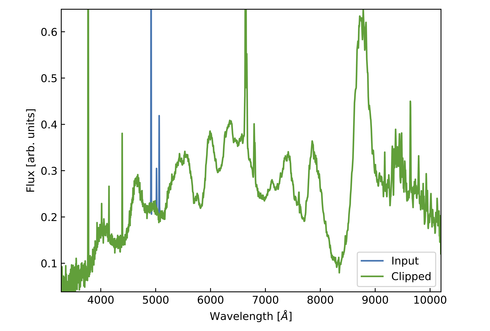

Quickstart
==========

This tutorial uses a spectrum of SN1997ef (WISeREP). This spectrum can be downloaded :download:`here <_static/1997ef_1998-01-28_00-00-00_Lick-3m_KAST_SUSPECT.dat>`

The spectrum has the following layout:

.. code-block:: texttt

    wave,flux,flux_err
    3280,0.0168468002229929,
    3281,0.0313779003918171,
    3282,0.0459089986979961,

Loading a spectrum
------------------
The code takes a spectrum from the user and plots it. 
Here is an example code showing how to input a spectrum using pandas.
We extract the wavelength and flux.

.. code-block:: Python

    data = pd.read_csv("1997ef_1998-01-28_00-00-00_Lick-3m_KAST_SUSPECT.dat", sep=",")
    wlen = data["wave"].to_numpy()
    flux = data["flux"].to_numpy()

Labelling emission lines
------------------------

This code allows emission lines to be labelled.

.. code-block:: Python

    emlines = define_regions(wlen, flux)

The code will surface a plot of the spectrum, then ask the user to double click the plot on either side of any emission lines they wish to remove.
On each click, a line is drawn. 
Every pair of clicks is assumed to bracket a line that needs to be removed, these are called bounding lines. 
Groups of emission lines can be bounded using just two bounding lines, provided they are sufficiently close (a couple of samples apart).

Removal of emission lines
-------------------------
The following code is used to remove emission lines. 

.. code-block:: Python

    flux_clipd = clip_lines(wlen, flux, emlines)

The code then iterates over each pair of bounding lines. The code selects a chunk of the input flux array +/-100 Å away from the lower/upper bounding lines by default.

Values within the bounding lines in this chunk are removed before performing a spline fit to the flux (with 5 knots by default). If other user-defined emission lines are present in the fitting window, they are removed as well. 

Within the chunk, residuals between the spline and the original spectrum outside the bounding lines are computed. The mean and standard deviation of the difference array is calculated. This is used to resample the spectrum by adding noise to the spline between the bounding lines.

This is performed iteratively from the blue end of the spectrum for each pair of bounding lines.

The code returns the array of flux with the emission lines removed and resampled using the uncertainty arrays generated during fitting.

**Note** If desired, it is possible to supply the emission lines as a list. The length of the list must be even, and the values must be within the wavelength range.

**Note:** Even when a line has been fit, the code performs the next for the next line on the original spectrum, i.e. without removing the previously fit line.

Spectra of SN1997ef from the Weizmann Interactive Supernova Data Repository `WISeREP <https://www.wiserep.org/object/4567>`_.

Saving the clipped spectrum
---------------------------

.. code-block:: Python

    data.loc[:, "flux_clipd"] = flux_clipd

    data.to_csv(
        "1997ef_1998-01-28_00-00-00_Lick-3m_KAST_SUSPECT_clipd.dat",
        sep=",",
        na_rep="",
        index=False,
    )