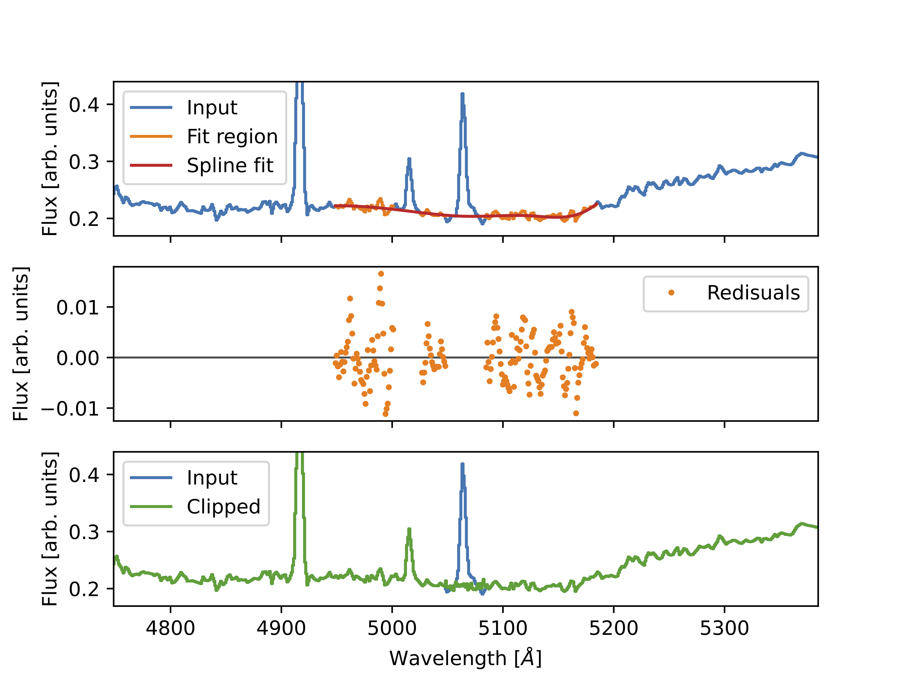

.. emlineclipper documentation master file, created by
   sphinx-quickstart on Thu Nov 21 15:02:05 2024.
   You can adapt this file completely to your liking, but it should at least
   contain the root `toctree` directive.

emlineclipper documentation
===========================

.. image:: https://img.shields.io/github/v/release/GabrielF98/emlineclipper?color=teal
   :alt: GitHub Release

Python library to clip emission lines in supernova spectra. Developed by Gabriel Finneran at University College Dublin, Ireland. 

A brief description of the tool is given here. Further information may be found in `Finneran et al. (2024) <https://arxiv.org/abs/2411.11503>`_ (see below for how to cite this work!).

The source code can be found on `GitHub <https://github.com/GabrielF98/emlineclipper>`_. Issues can be logged `here <https://github.com/GabrielF98/emlineclipper/issues>`_.

You can also contact me at `by email <mailto:gabfin15@gmail.com>`_.

How it works
------------
The code takes a spectrum from the user and plots it. It then asks the user to double click the plot at the edges of emission lines to remove.

On each click, a line is drawn. Every pair of clicks is assumed to bracket a line that needs to be removed, these are called bounding lines. Groups of emission lines can be bounded using just two bounding lines, provided they are sufficiently close (a couple of samples apart).

The code then iterates over each pair of bounding lines. The code selects a chunk of the input flux array +/-100 Å away from the lower/upper bounding lines by default.

Values within the bounding lines in this chunk are removed before performing a spline fit to the flux (with 5 knots by default). If other user-defined emission lines are present in the fitting window, they are removed as well. 

Within the chunk, residuals between the spline and the original spectrum outside the bounding lines are computed. The mean and standard deviation of the difference array is calculated. This is used to resample the spectrum by adding noise to the spline between the bounding lines.

This is performed iteratively from the blue end of the spectrum for each pair of bounding lines.

The code returns the array of flux with the emission lines removed and resampled using hte uncertainty arrays generated during fitting.

**Note:** Even when a line has been fit, the code performs the next for the next line on the original spectrum, i.e. without removing the previously fit line.

How to cite this code in your work
----------------------------------
If you use emlineclipper in your work, please consider citing `Finneran et al. (2024) <https://arxiv.org/abs/2411.11503>`_ (see below for bibtex). I would also appreciate if you could add an acknowledgement such as:

.. code-block:: latex

   To remove emission lines from supernova spectra, 
   this work has made use of \texttt{emlineclipper}, 
   developed by Gabriel Finneran and available at: 
   \url{https://github.com/GabrielF98/emlineclipper}.

.. code-block:: bibtex

   @article{2024arXiv241111503F,
         author = {{Finneran}, Gabriel and {Cotter}, Laura and {Martin-Carrillo}, Antonio},
         title = "{Velocity evolution of broad-line Ic supernovae with and without gamma-ray bursts}",
         journal = {arXiv e-prints},
      keywords = {Astrophysics - High Energy Astrophysical Phenomena},
            year = 2024,
         month = nov,
            eid = {arXiv:2411.11503},
         pages = {arXiv:2411.11503},
   archivePrefix = {arXiv},
         eprint = {2411.11503},
   primaryClass = {astro-ph.HE},
         adsurl = {https://ui.adsabs.harvard.edu/abs/2024arXiv241111503F},
         adsnote = {Provided by the SAO/NASA Astrophysics Data System},
   }

Sources for the example spectra
-------------------------------
Spectra of SN1997ef from the Weizmann Interactive Supernova Data Repository `WISeREP <https://www.wiserep.org/object/4567>`_.

.. toctree::
   :maxdepth: 2
   :caption: Contents:

Example
=======
This tutorial uses a spectrum of SN1997ef (WISeREP). This spectrum can be downloaded here:

.. _spectrum: _static

Module documentation
====================
.. automodule:: emclip
   :members:
